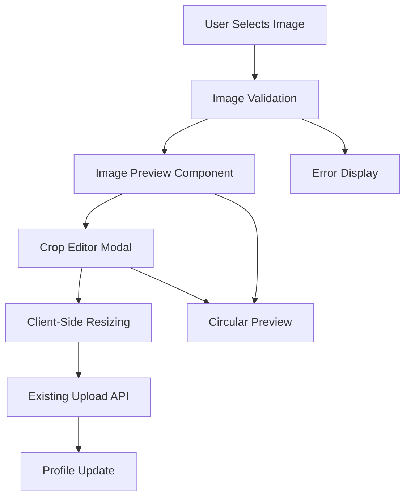

# Design Document

## Overview

This design enhances the avatar upload experience by adding client-side image processing capabilities including preview, resizing, and lightweight editing. The solution maintains full compatibility with the existing backend API while providing a significantly improved user experience through modern browser APIs.

## Architecture

### High-Level Architecture



### Component Architecture

The enhancement introduces new components while leveraging existing infrastructure:

- **AvatarImageUpload**: Main component handling file selection and orchestration
- **ImagePreview**: Displays selected image with circular crop preview
- **ImageCropEditor**: Lightweight modal for crop selection
- **ImageProcessor**: Utility service for client-side resizing and processing

## Components and Interfaces

### Core Components

#### AvatarImageUpload Component
```typescript
interface AvatarImageUploadProps {
  onImageSelected: (processedFile: File) => void;
  onError: (error: string) => void;
  currentAvatarUrl?: string;
  disabled?: boolean;
}

interface AvatarImageUploadState {
  selectedFile: File | null;
  previewUrl: string | null;
  isProcessing: boolean;
  showCropEditor: boolean;
  cropData: CropData | null;
}
```

#### ImageCropEditor Component
```typescript
interface ImageCropEditorProps {
  imageFile: File;
  onCropConfirm: (cropData: CropData) => void;
  onCancel: () => void;
  isOpen: boolean;
}

interface CropData {
  x: number;
  y: number;
  width: number;
  height: number;
  scale: number;
}
```

#### ImagePreview Component
```typescript
interface ImagePreviewProps {
  imageUrl: string;
  cropData?: CropData;
  size?: 'small' | 'medium' | 'large';
  showCircularPreview?: boolean;
}
```

### Service Layer

#### ImageProcessor Service
```typescript
interface ImageProcessorService {
  validateImage(file: File): Promise<ValidationResult>;
  resizeImage(file: File, maxSize: number): Promise<File>;
  cropImage(file: File, cropData: CropData): Promise<File>;
  generatePreviewUrl(file: File): string;
  revokePreviewUrl(url: string): void;
}

interface ValidationResult {
  isValid: boolean;
  error?: string;
  fileSize: number;
  dimensions: { width: number; height: number };
}
```

## Data Models

### Enhanced File Validation
```typescript
interface ImageValidationConfig {
  maxFileSize: number; // 10MB = 10 * 1024 * 1024
  allowedTypes: string[]; // ['image/jpeg', 'image/png', 'image/webp']
  minDimensions: { width: number; height: number };
  maxDimensions: { width: number; height: number };
}

interface ProcessingConfig {
  targetSize: number; // 512px for avatar display
  quality: number; // 0.8 for good quality/size balance
  outputFormat: 'jpeg' | 'png' | 'webp';
}
```

### Crop Data Model
```typescript
interface CropSelection {
  x: number; // X coordinate of crop start
  y: number; // Y coordinate of crop start  
  width: number; // Width of crop area
  height: number; // Height of crop area (should equal width for square crop)
  scale: number; // Scale factor for display vs actual image
}
```

## Error Handling

### Validation Errors
- **File Size**: Clear messaging for 10MB limit with current file size
- **File Type**: Specific guidance on supported formats (JPEG, PNG, WebP)
- **Image Dimensions**: Minimum size requirements for quality avatars
- **Processing Errors**: Fallback handling for browser compatibility issues

### Error Recovery Strategies
- **Automatic Retry**: For transient processing failures
- **Graceful Degradation**: Fall back to basic upload if advanced features fail
- **User Guidance**: Clear instructions for resolving common issues
- **Logging**: Comprehensive error tracking for debugging

## Testing Strategy

### Unit Tests
- **ImageProcessor Service**: Validate all image processing functions
- **Component Logic**: Test state management and user interactions
- **Validation Logic**: Comprehensive file validation scenarios
- **Error Handling**: All error conditions and recovery paths

### Integration Tests
- **Upload Flow**: Complete image selection to profile update
- **Browser Compatibility**: Canvas API and File API functionality
- **Performance**: Large file handling and processing speed
- **Memory Management**: Proper cleanup of object URLs and canvas elements

### Visual Regression Tests
- **Preview Accuracy**: Circular preview matches final avatar appearance
- **Crop Editor**: Visual consistency across different image types
- **Responsive Design**: Component behavior on different screen sizes

## Implementation Details

### Client-Side Image Processing

#### Canvas-Based Resizing
```typescript
async function resizeImage(file: File, targetSize: number): Promise<File> {
  return new Promise((resolve, reject) => {
    const canvas = document.createElement('canvas');
    const ctx = canvas.getContext('2d');
    const img = new Image();
    
    img.onload = () => {
      // Calculate dimensions maintaining aspect ratio
      const { width, height } = calculateDimensions(img, targetSize);
      
      canvas.width = width;
      canvas.height = height;
      
      // High-quality resize with proper scaling
      ctx.imageSmoothingEnabled = true;
      ctx.imageSmoothingQuality = 'high';
      ctx.drawImage(img, 0, 0, width, height);
      
      canvas.toBlob(resolve, 'image/jpeg', 0.8);
    };
    
    img.onerror = reject;
    img.src = URL.createObjectURL(file);
  });
}
```

#### Crop Implementation
```typescript
async function cropImage(file: File, cropData: CropData): Promise<File> {
  // Load image and apply crop selection
  // Return cropped file ready for resizing
}
```

### Integration with Existing Components

#### ProfileCreationModal Enhancement
- Replace basic file input with AvatarImageUpload component
- Maintain existing validation and error handling patterns
- Preserve form submission flow and API integration

#### ProfileSettingsModal Enhancement  
- Add avatar change functionality using same components
- Maintain existing modal patterns and user experience
- Integrate with current profile update workflow

### Browser Compatibility

#### Required APIs
- **Canvas API**: For image resizing and processing
- **File API**: For file handling and blob creation
- **URL.createObjectURL**: For preview generation
- **HTMLCanvasElement.toBlob**: For file output

#### Fallback Strategy
- Detect API availability on component mount
- Graceful degradation to basic file upload if APIs unavailable
- Clear messaging about browser requirements

### Performance Considerations

#### Memory Management
- Proper cleanup of object URLs after use
- Canvas element disposal after processing
- File object handling to prevent memory leaks

#### Processing Optimization
- Lazy loading of image processing utilities
- Debounced preview updates during crop adjustment
- Efficient canvas operations with proper scaling

#### User Experience
- Loading states during processing operations
- Progress indication for large file processing
- Responsive feedback for all user interactions

### Security Considerations

#### File Validation
- Client-side validation as UX enhancement only
- Server-side validation remains authoritative
- Proper MIME type checking beyond file extensions

#### Content Security
- No execution of file content during processing
- Safe handling of user-provided image data
- Proper sanitization of file metadata

## Dependencies

### New Dependencies Required
```json
{
  "dependencies": {
    // No new runtime dependencies required
    // All functionality uses native browser APIs
  },
  "devDependencies": {
    "@types/canvas": "^2.11.4" // For TypeScript support
  }
}
```

### Browser API Requirements
- Canvas API (widely supported)
- File API (widely supported)  
- Blob API (widely supported)
- URL.createObjectURL (widely supported)

## Migration Strategy

### Phase 1: Core Infrastructure
- Implement ImageProcessor service
- Create base AvatarImageUpload component
- Add basic preview functionality

### Phase 2: Enhanced Features
- Implement crop editor modal
- Add circular preview capability
- Integrate with existing modals

### Phase 3: Polish and Optimization
- Performance optimization
- Enhanced error handling
- Comprehensive testing

### Backward Compatibility
- Existing avatar upload API remains unchanged
- Current file size limits respected during transition
- Graceful fallback for unsupported browsers