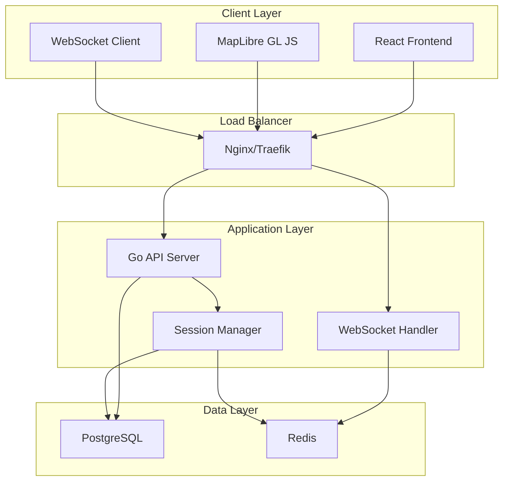

# Design Document

## Overview

BreakoutGlobe Foundation is built as a modern web application with a React TypeScript frontend and Go backend, utilizing WebSockets for real-time communication. The architecture follows a microservices approach with clear separation between the map interface, user session management, POI system, and real-time communication layers.

The system uses MapLibre GL JS for the interactive map, PostgreSQL for persistent data storage, Redis for session management and real-time presence, and Docker for containerization. The design prioritizes performance, scalability, and maintainability while establishing a solid foundation for future video conferencing integration.

## Architecture

### High-Level Architecture



### Technology Stack

**Frontend:**
- React 18 with TypeScript for type safety and modern React features
- Vite for fast development and optimized builds
- Tailwind CSS for utility-first styling
- Zustand for lightweight state management
- MapLibre GL JS for interactive mapping
- Socket.io-client for WebSocket communication

**Backend:**
- Go 1.21+ with Gin framework for HTTP API
- Gorilla WebSocket for real-time communication
- GORM for database ORM
- Go-Redis for Redis operations
- Structured logging with logrus

**Infrastructure:**
- PostgreSQL 15 for persistent data storage
- Redis 7 for session management and pub/sub
- Docker and Docker Compose for containerization
- Nginx for reverse proxy and static file serving

## Components and Interfaces

### Frontend Components

#### MapContainer Component
```typescript
interface MapContainerProps {
  onAvatarMove: (position: LatLng) => void;
  onPOICreate: (poi: CreatePOIRequest) => void;
  onPOIClick: (poiId: string) => void;
}

interface MapState {
  center: LatLng;
  zoom: number;
  avatars: Avatar[];
  pois: POI[];
  selectedPOI: POI | null;
}
```

#### Avatar System
```typescript
interface Avatar {
  id: string;
  userId: string;
  position: LatLng;
  isMoving: boolean;
  lastUpdate: Date;
}

interface AvatarManager {
  moveAvatar(userId: string, position: LatLng): void;
  addAvatar(avatar: Avatar): void;
  removeAvatar(userId: string): void;
  getAvatarsInBounds(bounds: LatLngBounds): Avatar[];
}
```

#### POI Management
```typescript
interface POI {
  id: string;
  name: string;
  description?: string;
  position: LatLng;
  createdBy: string;
  participantCount: number;
  maxParticipants: number;
  createdAt: Date;
}

interface POIManager {
  createPOI(poi: CreatePOIRequest): Promise<POI>;
  joinPOI(poiId: string): Promise<void>;
  leavePOI(poiId: string): Promise<void>;
  getPOIsInBounds(bounds: LatLngBounds): POI[];
}
```

### Backend API Endpoints

#### Session Management
```
POST /api/sessions - Create new user session
GET /api/sessions/:id - Get session details
PUT /api/sessions/:id/avatar - Update avatar position
DELETE /api/sessions/:id - End session
```

#### POI Management
```
GET /api/pois - Get POIs in map bounds
POST /api/pois - Create new POI
PUT /api/pois/:id - Update POI details
DELETE /api/pois/:id - Delete POI
POST /api/pois/:id/join - Join POI
POST /api/pois/:id/leave - Leave POI
```

#### WebSocket Events
```
// Client to Server
avatar_move: { position: LatLng }
poi_create: { name: string, description?: string, position: LatLng }
poi_join: { poiId: string }
poi_leave: { poiId: string }

// Server to Client
avatar_updated: { userId: string, position: LatLng }
poi_created: { poi: POI }
poi_updated: { poi: POI }
user_joined_poi: { userId: string, poiId: string }
user_left_poi: { userId: string, poiId: string }
```

### Backend Services

#### Session Service
```go
type SessionService interface {
    CreateSession(ctx context.Context) (*Session, error)
    GetSession(ctx context.Context, sessionID string) (*Session, error)
    UpdateAvatarPosition(ctx context.Context, sessionID string, position LatLng) error
    ExpireSessions(ctx context.Context) error
}

type Session struct {
    ID          string    `json:"id" gorm:"primaryKey"`
    UserID      string    `json:"userId" gorm:"index"`
    AvatarPos   LatLng    `json:"avatarPosition" gorm:"embedded"`
    CreatedAt   time.Time `json:"createdAt"`
    LastActive  time.Time `json:"lastActive"`
    IsActive    bool      `json:"isActive"`
}
```

#### POI Service
```go
type POIService interface {
    CreatePOI(ctx context.Context, req CreatePOIRequest) (*POI, error)
    GetPOIsInBounds(ctx context.Context, bounds Bounds) ([]*POI, error)
    JoinPOI(ctx context.Context, poiID, userID string) error
    LeavePOI(ctx context.Context, poiID, userID string) error
    GetPOIParticipants(ctx context.Context, poiID string) ([]*Session, error)
}

type POI struct {
    ID              string    `json:"id" gorm:"primaryKey"`
    Name            string    `json:"name" gorm:"not null"`
    Description     string    `json:"description"`
    Position        LatLng    `json:"position" gorm:"embedded"`
    CreatedBy       string    `json:"createdBy" gorm:"index"`
    MaxParticipants int       `json:"maxParticipants" gorm:"default:10"`
    CreatedAt       time.Time `json:"createdAt"`
}
```

#### WebSocket Manager
```go
type WebSocketManager interface {
    RegisterClient(sessionID string, conn *websocket.Conn) error
    UnregisterClient(sessionID string) error
    BroadcastToAll(event string, data interface{}) error
    BroadcastToPOI(poiID string, event string, data interface{}) error
    SendToClient(sessionID string, event string, data interface{}) error
}
```

## Data Models

### Database Schema

#### Sessions Table
```sql
CREATE TABLE sessions (
    id VARCHAR(36) PRIMARY KEY,
    user_id VARCHAR(36) NOT NULL,
    avatar_pos_lat DECIMAL(10, 8) NOT NULL,
    avatar_pos_lng DECIMAL(11, 8) NOT NULL,
    created_at TIMESTAMP DEFAULT CURRENT_TIMESTAMP,
    last_active TIMESTAMP DEFAULT CURRENT_TIMESTAMP,
    is_active BOOLEAN DEFAULT true,
    INDEX idx_user_id (user_id),
    INDEX idx_last_active (last_active)
);
```

#### POIs Table
```sql
CREATE TABLE pois (
    id VARCHAR(36) PRIMARY KEY,
    name VARCHAR(255) NOT NULL,
    description TEXT,
    position_lat DECIMAL(10, 8) NOT NULL,
    position_lng DECIMAL(11, 8) NOT NULL,
    created_by VARCHAR(36) NOT NULL,
    max_participants INT DEFAULT 10,
    created_at TIMESTAMP DEFAULT CURRENT_TIMESTAMP,
    INDEX idx_position (position_lat, position_lng),
    INDEX idx_created_by (created_by)
);
```

#### POI Participants Table
```sql
CREATE TABLE poi_participants (
    poi_id VARCHAR(36) NOT NULL,
    session_id VARCHAR(36) NOT NULL,
    joined_at TIMESTAMP DEFAULT CURRENT_TIMESTAMP,
    PRIMARY KEY (poi_id, session_id),
    FOREIGN KEY (poi_id) REFERENCES pois(id) ON DELETE CASCADE,
    FOREIGN KEY (session_id) REFERENCES sessions(id) ON DELETE CASCADE
);
```

### Redis Data Structures

#### Session Presence
```
Key: session:{sessionId}
Value: {
  "userId": "uuid",
  "avatarPosition": {"lat": 40.7128, "lng": -74.0060},
  "lastActive": "2024-01-15T10:30:00Z",
  "currentPOI": "poi-uuid-or-null"
}
TTL: 1800 seconds (30 minutes)
```

#### POI Participant Counts
```
Key: poi:participants:{poiId}
Value: Set of session IDs
Operations: SADD, SREM, SCARD for real-time counts
```

#### Real-time Events Channel
```
Channel: map_events
Messages: {
  "type": "avatar_move|poi_update|user_join_poi|user_leave_poi",
  "data": {...},
  "timestamp": "2024-01-15T10:30:00Z"
}
```

## Error Handling

### Frontend Error Handling

#### Network Errors
- Implement exponential backoff for failed API requests
- Display connection status indicator
- Queue actions during network outages and replay on reconnection
- Graceful degradation when WebSocket connection fails

#### User Input Validation
- Client-side validation for POI creation (name length, position bounds)
- Real-time feedback for invalid actions
- Prevent duplicate POI creation in same location

#### State Management Errors
- Optimistic updates with rollback on server rejection
- Conflict resolution for concurrent POI modifications
- Avatar position synchronization on reconnection

### Backend Error Handling

#### Database Errors
```go
type ErrorHandler struct {
    logger *logrus.Logger
}

func (e *ErrorHandler) HandleDBError(err error, operation string) error {
    e.logger.WithFields(logrus.Fields{
        "error": err.Error(),
        "operation": operation,
    }).Error("Database operation failed")
    
    if errors.Is(err, gorm.ErrRecordNotFound) {
        return NewNotFoundError("Resource not found")
    }
    
    return NewInternalError("Database operation failed")
}
```

#### WebSocket Connection Errors
- Automatic client reconnection with exponential backoff
- Message queuing for disconnected clients
- Connection health monitoring and cleanup

#### Rate Limiting
```go
type RateLimiter struct {
    redis *redis.Client
}

func (r *RateLimiter) CheckLimit(userID string, action string) error {
    key := fmt.Sprintf("rate_limit:%s:%s", userID, action)
    count, err := r.redis.Incr(ctx, key).Result()
    if err != nil {
        return err
    }
    
    if count == 1 {
        r.redis.Expire(ctx, key, time.Minute)
    }
    
    if count > GetActionLimit(action) {
        return NewRateLimitError("Too many requests")
    }
    
    return nil
}
```

## Testing Strategy

### Test-Driven Development (TDD) Approach

The project follows strict TDD methodology with automated test execution on every commit. All features must be implemented following the Red-Green-Refactor cycle:

1. **Red:** Write failing tests first
2. **Green:** Write minimal code to make tests pass
3. **Refactor:** Improve code while keeping tests green

### Automated Testing Pipeline

#### CI/CD Configuration
```yaml
# .github/workflows/test.yml
name: Test Suite
on: [push, pull_request]

jobs:
  frontend-tests:
    runs-on: ubuntu-latest
    steps:
      - uses: actions/checkout@v4
      - uses: actions/setup-node@v4
        with:
          node-version: '18'
      - run: npm ci
      - run: npm run test:unit
      - run: npm run test:integration
      - run: npm run test:e2e

  backend-tests:
    runs-on: ubuntu-latest
    services:
      postgres:
        image: postgres:15
        env:
          POSTGRES_PASSWORD: test
        options: >-
          --health-cmd pg_isready
          --health-interval 10s
          --health-timeout 5s
          --health-retries 5
      redis:
        image: redis:7
        options: >-
          --health-cmd "redis-cli ping"
          --health-interval 10s
          --health-timeout 5s
          --health-retries 5
    steps:
      - uses: actions/checkout@v4
      - uses: actions/setup-go@v4
        with:
          go-version: '1.21'
      - run: go test -v -race -coverprofile=coverage.out ./...
      - run: go tool cover -html=coverage.out -o coverage.html
      - uses: actions/upload-artifact@v3
        with:
          name: coverage-report
          path: coverage.html
```

#### Pre-commit Hooks
```yaml
# .pre-commit-config.yaml
repos:
  - repo: local
    hooks:
      - id: frontend-tests
        name: Frontend Tests
        entry: npm run test:unit
        language: system
        pass_filenames: false
      - id: backend-tests
        name: Backend Tests
        entry: go test ./...
        language: system
        pass_filenames: false
      - id: lint
        name: Lint Code
        entry: npm run lint && golangci-lint run
        language: system
        pass_filenames: false
```

### Frontend Testing

#### Testing Stack
- **Vitest:** Fast unit test runner with TypeScript support
- **React Testing Library:** Component testing with user-centric approach
- **MSW (Mock Service Worker):** API mocking for integration tests
- **Playwright:** E2E testing with real browser automation
- **Testing Library User Event:** Realistic user interaction simulation

#### Unit Tests (TDD Approach)
```typescript
// Example TDD test structure
describe('AvatarManager', () => {
  describe('moveAvatar', () => {
    it('should update avatar position when valid coordinates provided', () => {
      // Red: Write failing test first
      const manager = new AvatarManager();
      const userId = 'user-123';
      const newPosition = { lat: 40.7128, lng: -74.0060 };
      
      manager.moveAvatar(userId, newPosition);
      
      const avatar = manager.getAvatar(userId);
      expect(avatar.position).toEqual(newPosition);
      expect(avatar.isMoving).toBe(true);
    });
    
    it('should reject invalid coordinates', () => {
      const manager = new AvatarManager();
      const userId = 'user-123';
      const invalidPosition = { lat: 91, lng: -74.0060 }; // Invalid latitude
      
      expect(() => manager.moveAvatar(userId, invalidPosition))
        .toThrow('Invalid coordinates');
    });
  });
});
```

#### Integration Tests
```typescript
// WebSocket integration test
describe('WebSocket Integration', () => {
  it('should synchronize avatar movements across clients', async () => {
    const { client1, client2 } = await setupTestClients();
    
    // Client 1 moves avatar
    await client1.moveAvatar({ lat: 40.7128, lng: -74.0060 });
    
    // Client 2 should receive the update
    await waitFor(() => {
      expect(client2.getAvatars()).toContainEqual(
        expect.objectContaining({
          userId: client1.userId,
          position: { lat: 40.7128, lng: -74.0060 }
        })
      );
    });
  });
});
```

#### E2E Tests
```typescript
// Playwright E2E test
test('complete user journey', async ({ page }) => {
  await page.goto('/');
  
  // Place avatar
  await page.click('[data-testid="map-container"]', { 
    position: { x: 400, y: 300 } 
  });
  
  // Create POI
  await page.click('[data-testid="map-container"]', { 
    button: 'right',
    position: { x: 500, y: 400 } 
  });
  await page.fill('[data-testid="poi-name-input"]', 'Test Meeting Room');
  await page.click('[data-testid="create-poi-button"]');
  
  // Verify POI appears
  await expect(page.locator('[data-testid="poi-marker"]')).toBeVisible();
  
  // Join POI
  await page.click('[data-testid="poi-marker"]');
  await page.click('[data-testid="join-poi-button"]');
  
  // Verify participant count
  await expect(page.locator('[data-testid="participant-count"]'))
    .toHaveText('1');
});
```

### Backend Testing

#### Testing Stack
- **Go testing package:** Built-in testing framework
- **Testify:** Assertion library and test suites
- **Testcontainers:** Integration testing with real databases
- **GoMock:** Mock generation for interfaces
- **httptest:** HTTP handler testing

#### Unit Tests (TDD Approach)
```go
// TDD example for POI service
func TestPOIService_CreatePOI(t *testing.T) {
    suite.Run(t, new(POIServiceTestSuite))
}

type POIServiceTestSuite struct {
    suite.Suite
    service *POIService
    mockRepo *mocks.MockPOIRepository
}

func (s *POIServiceTestSuite) SetupTest() {
    s.mockRepo = mocks.NewMockPOIRepository(s.T())
    s.service = NewPOIService(s.mockRepo)
}

func (s *POIServiceTestSuite) TestCreatePOI_Success() {
    // Red: Define expected behavior
    req := CreatePOIRequest{
        Name: "Test POI",
        Position: LatLng{Lat: 40.7128, Lng: -74.0060},
        CreatedBy: "user-123",
    }
    
    expectedPOI := &POI{
        ID: "poi-123",
        Name: req.Name,
        Position: req.Position,
        CreatedBy: req.CreatedBy,
        MaxParticipants: 10,
    }
    
    s.mockRepo.EXPECT().
        Create(mock.MatchedBy(func(poi *POI) bool {
            return poi.Name == req.Name && poi.CreatedBy == req.CreatedBy
        })).
        Return(expectedPOI, nil)
    
    // Green: Test the implementation
    result, err := s.service.CreatePOI(context.Background(), req)
    
    s.NoError(err)
    s.Equal(expectedPOI.Name, result.Name)
    s.Equal(expectedPOI.Position, result.Position)
}

func (s *POIServiceTestSuite) TestCreatePOI_ValidationError() {
    req := CreatePOIRequest{
        Name: "", // Invalid: empty name
        Position: LatLng{Lat: 40.7128, Lng: -74.0060},
        CreatedBy: "user-123",
    }
    
    result, err := s.service.CreatePOI(context.Background(), req)
    
    s.Error(err)
    s.Nil(result)
    s.Contains(err.Error(), "name is required")
}
```

#### Integration Tests with Testcontainers
```go
func TestPOIRepository_Integration(t *testing.T) {
    ctx := context.Background()
    
    // Start test database
    postgres, err := testcontainers.GenericContainer(ctx, testcontainers.GenericContainerRequest{
        ContainerRequest: testcontainers.ContainerRequest{
            Image:        "postgres:15",
            ExposedPorts: []string{"5432/tcp"},
            Env: map[string]string{
                "POSTGRES_DB":       "testdb",
                "POSTGRES_PASSWORD": "testpass",
                "POSTGRES_USER":     "testuser",
            },
            WaitingFor: wait.ForLog("database system is ready to accept connections"),
        },
        Started: true,
    })
    require.NoError(t, err)
    defer postgres.Terminate(ctx)
    
    // Get connection details and run tests
    host, _ := postgres.Host(ctx)
    port, _ := postgres.MappedPort(ctx, "5432")
    
    db := setupTestDB(host, port.Port())
    repo := NewPOIRepository(db)
    
    // Run integration tests
    t.Run("CreateAndRetrievePOI", func(t *testing.T) {
        poi := &POI{
            Name: "Integration Test POI",
            Position: LatLng{Lat: 40.7128, Lng: -74.0060},
            CreatedBy: "user-123",
        }
        
        created, err := repo.Create(poi)
        require.NoError(t, err)
        require.NotEmpty(t, created.ID)
        
        retrieved, err := repo.GetByID(created.ID)
        require.NoError(t, err)
        assert.Equal(t, poi.Name, retrieved.Name)
    })
}
```

### Test Coverage Requirements

#### Coverage Targets
- **Backend:** Minimum 85% code coverage
- **Frontend:** Minimum 80% code coverage
- **Critical paths:** 100% coverage (authentication, data persistence, real-time sync)

#### Coverage Reporting
```bash
# Backend coverage
go test -coverprofile=coverage.out ./...
go tool cover -html=coverage.out

# Frontend coverage
npm run test:coverage
```

### Performance Testing

#### Load Testing with k6
```javascript
// load-test.js
import { check } from 'k6';
import { WebSocket } from 'k6/ws';
import http from 'k6/http';

export let options = {
  stages: [
    { duration: '2m', target: 50 },   // Ramp up
    { duration: '5m', target: 50 },   // Stay at 50 users
    { duration: '2m', target: 100 },  // Ramp to 100 users
    { duration: '5m', target: 100 },  // Stay at 100 users
    { duration: '2m', target: 0 },    // Ramp down
  ],
};

export default function () {
  // Test WebSocket connections
  const ws = new WebSocket('ws://localhost:8080/ws');
  
  ws.onopen = () => {
    ws.send(JSON.stringify({
      type: 'avatar_move',
      data: { position: { lat: 40.7128, lng: -74.0060 } }
    }));
  };
  
  ws.onmessage = (event) => {
    const data = JSON.parse(event.data);
    check(data, {
      'message received': (data) => data.type !== undefined,
    });
  };
  
  // Test HTTP API
  const response = http.get('http://localhost:8080/api/pois');
  check(response, {
    'status is 200': (r) => r.status === 200,
    'response time < 200ms': (r) => r.timings.duration < 200,
  });
}
```

### Continuous Testing

#### Test Automation Rules
1. **All commits must pass tests** - No direct pushes to main without green CI
2. **New features require tests first** - TDD enforcement through code review
3. **Coverage cannot decrease** - Ratcheting coverage requirements
4. **Performance regression detection** - Automated performance testing on PRs
5. **Flaky test quarantine** - Automatic detection and isolation of unreliable tests

#### Test Data Management
- **Database seeding:** Consistent test data across environments
- **Test isolation:** Each test runs with clean state
- **Parallel execution:** Tests run concurrently for speed
- **Test categorization:** Unit, integration, E2E tests run at appropriate times