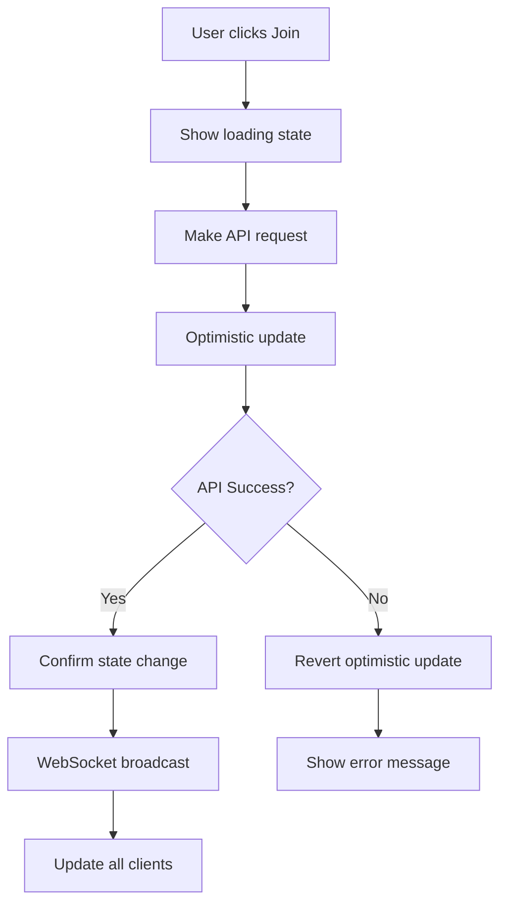

# Enhanced POI Interaction - Design Document

## Overview

This design document outlines the implementation of enhanced POI interaction features including detailed participant information, discussion timing statistics, and intuitive join/leave behavior. The solution provides a rich collaborative experience with automatic leave functionality and real-time synchronization.

## Current State Analysis

### What's Working
- ✅ POI details panel displays basic information
- ✅ POI data loads from backend API (`/api/pois`)
- ✅ Basic participant counts display
- ✅ Backend APIs exist for join/leave operations
- ✅ WebSocket connection established for real-time updates

### What Needs Enhancement
- ❌ No detailed participant list with usernames
- ❌ No discussion timer functionality
- ❌ Join/Leave buttons need proper integration
- ❌ No automatic leave behavior on map/POI clicks
- ❌ No comprehensive real-time synchronization of POI state

## Technical Architecture

### Frontend Components

#### POIDetailsPanel Component
**Current State:**
```typescript
// Displays basic POI info and participant count
<div>Participants ({poi.participantCount || 0}/{poi.maxParticipants})</div>
```

**Required Enhancements:**
1. **Participant List Display**
   - Show individual usernames of current participants
   - Display user avatars or initials if available
   - Highlight current user in the list

2. **Discussion Timer**
   - Show active discussion time when 2+ participants
   - Real-time timer updates every second
   - Display "No active discussion" when < 2 participants

3. **Join Button Integration**
   - Single "Join" button (no explicit leave button)
   - Disable when POI is at capacity
   - Show loading state during join operation

4. **Enhanced Information Display**
   ```typescript
   <div className="poi-participants">
     <h4>Participants ({participantCount}/{maxParticipants})</h4>
     <ul className="participant-list">
       {participants.map(user => (
         <li key={user.id} className={user.id === currentUserId ? 'current-user' : ''}>
           {user.username}
         </li>
       ))}
     </ul>
   </div>
   
   <div className="discussion-timer">
     {discussionActive ? 
       `Discussion active for: ${formatTime(discussionDuration)}` : 
       'No active discussion'
     }
   </div>
   
   <button 
     className="join-button" 
     onClick={handleJoin}
     disabled={isAtCapacity || isCurrentUserInPOI}
   >
     {isAtCapacity ? 'Full' : 'Join Discussion'}
   </button>
   ```

#### POI Store (Zustand)
**Current State:**
- Manages POI list and basic data
- No tracking of user participation or detailed state

**Required Additions:**
1. **Enhanced POI State Management**
   ```typescript
   interface POIState {
     pois: Map<string, EnhancedPOI>;
     currentUserPOI: string | null; // Only one POI at a time
     selectedPOI: string | null; // Currently viewing POI details
   }
   
   interface EnhancedPOI {
     id: string;
     name: string;
     description: string;
     participants: Array<{ id: string; username: string }>;
     participantCount: number;
     maxParticipants: number;
     discussionStartTime: Date | null;
     discussionDuration: number; // in seconds
     isDiscussionActive: boolean;
   }
   ```

2. **Action Methods**
   - `joinPOI(poiId: string)` - Join POI and auto-leave current
   - `leavePOI()` - Leave current POI
   - `selectPOI(poiId: string)` - Show POI details panel
   - `closePOIDetails()` - Close details panel and leave POI
   - `updateDiscussionTimer(poiId: string, duration: number)`

3. **Auto-leave Logic**
   - Automatically leave current POI when joining another
   - Leave POI when clicking on map (not on POI)
   - Handle session cleanup on disconnect

### API Integration

#### HTTP Requests
**Endpoints to integrate:**
- `POST /api/pois/:id/join` - Join a POI
- `POST /api/pois/:id/leave` - Leave a POI

**Request Flow:**
1. User clicks join/leave button
2. Show loading state immediately
3. Make API request with session ID
4. Update local state optimistically
5. Handle success/error responses
6. Revert optimistic updates on failure

#### WebSocket Events
**Events to handle:**
- `poi_updated` - POI participant list and count changed
- `poi_joined` - User joined a POI (includes user details)
- `poi_left` - User left a POI
- `discussion_timer_updated` - Discussion timer state changed
- `poi_participants_list` - Full participant list with usernames

**Event Payloads:**
```typescript
interface POIJoinedEvent {
  poiId: string;
  userId: string;
  username: string;
  participantCount: number;
  participants: Array<{ id: string; username: string }>;
  discussionStartTime?: Date;
}

interface DiscussionTimerEvent {
  poiId: string;
  isActive: boolean;
  duration: number;
  startTime?: Date;
}
```

### State Management Flow



## Implementation Plan

### Phase 1: Enhanced POI Details Display
1. **Upgrade POIDetailsPanel Component**
   - Add participant list display with usernames
   - Implement discussion timer with real-time updates
   - Add enhanced join button with proper state management
   - Style improvements for better UX

2. **Extend POI Store with Enhanced State**
   - Add detailed POI state management
   - Implement single-POI participation model
   - Add discussion timer tracking
   - Create auto-leave logic

3. **Backend API Integration**
   - Modify join/leave endpoints to return participant details
   - Add discussion timer tracking on backend
   - Implement username resolution for participants

### Phase 2: Automatic Leave Behavior
1. **Map Click Handling**
   - Detect clicks on map areas (not POIs)
   - Implement auto-leave when clicking map
   - Close POI details panel on map clicks

2. **POI Switching Logic**
   - Auto-leave current POI when clicking different POI
   - Seamless transition between POIs
   - Maintain discussion timer continuity

### Phase 3: Real-time Synchronization & Timer
1. **Discussion Timer Implementation**
   - Track discussion start/pause/reset logic
   - Real-time timer updates across all clients
   - Persist timer state across sessions

2. **Enhanced WebSocket Events**
   - Broadcast participant list changes with usernames
   - Sync discussion timer updates
   - Handle complex state synchronization

### Phase 4: User Experience Polish
1. **Visual Enhancements**
   - Improved POI details panel design
   - Loading states and smooth transitions
   - Mobile-responsive participant lists

2. **Error Handling & Accessibility**
   - Comprehensive error handling
   - Keyboard navigation support
   - Screen reader compatibility

## Data Flow

### Join POI Flow
```typescript
// 1. User clicks join button
const handleJoin = async (poiId: string) => {
  // 2. Show loading state
  setLoading(true);
  
  // 3. Optimistic update
  poiStore.optimisticJoin(poiId);
  
  try {
    // 4. API request
    await apiService.joinPOI(poiId, sessionId);
    
    // 5. Confirm optimistic update
    poiStore.confirmJoin(poiId);
    
    // 6. Show success feedback
    showToast('Joined POI successfully');
  } catch (error) {
    // 7. Revert optimistic update
    poiStore.revertJoin(poiId);
    
    // 8. Show error feedback
    showToast('Failed to join POI');
  } finally {
    setLoading(false);
  }
};
```

### WebSocket Synchronization
```typescript
// Handle incoming POI updates
websocket.on('poi_updated', (data) => {
  poiStore.updatePOI(data.poiId, {
    participantCount: data.participantCount
  });
});

// Handle user join events
websocket.on('poi_joined', (data) => {
  if (data.userId === currentUserId) {
    poiStore.addJoinedPOI(data.poiId);
  }
  poiStore.updateParticipantCount(data.poiId, data.newCount);
});
```

## Error Handling Strategy

### Network Errors
- Show retry button for failed requests
- Implement exponential backoff for retries
- Graceful degradation when offline

### Server Errors
- Display user-friendly error messages
- Log detailed errors for debugging
- Revert optimistic updates

### Validation Errors
- Show specific validation messages
- Prevent invalid operations (joining full POI)
- Guide user to correct actions

## Testing Strategy

### Unit Tests
- POI store actions and state management
- API service functions
- Component click handlers and state updates

### Integration Tests
- Full join/leave workflow
- WebSocket event handling
- Error scenarios and recovery

### E2E Tests
- Multi-user POI interaction scenarios
- Real-time synchronization across browsers
- Session persistence and recovery

## Performance Considerations

### Optimistic Updates
- Immediate UI feedback for better UX
- Rollback mechanism for failed operations
- Minimal network round-trips

### WebSocket Efficiency
- Event batching for multiple rapid changes
- Selective updates to prevent unnecessary re-renders
- Connection management and reconnection

### State Management
- Efficient POI participation tracking
- Minimal re-renders on state changes
- Memory management for large POI lists

## Security Considerations

### Session Validation
- Include session ID in all API requests
- Validate user permissions on backend
- Handle session expiration gracefully

### Input Validation
- Validate POI IDs before API calls
- Prevent duplicate join/leave operations
- Rate limiting for rapid button clicks

## Success Metrics

### Functional Requirements
- ✅ Join button adds user to POI
- ✅ Leave button removes user from POI
- ✅ Participant counts update in real-time
- ✅ Button states reflect user participation

### Performance Requirements
- < 200ms response time for join/leave operations
- < 100ms UI feedback on button clicks
- Real-time updates within 500ms across clients

### User Experience Requirements
- Clear visual feedback for all operations
- Intuitive button states and labels
- Accessible keyboard navigation
- Mobile-friendly touch interactions