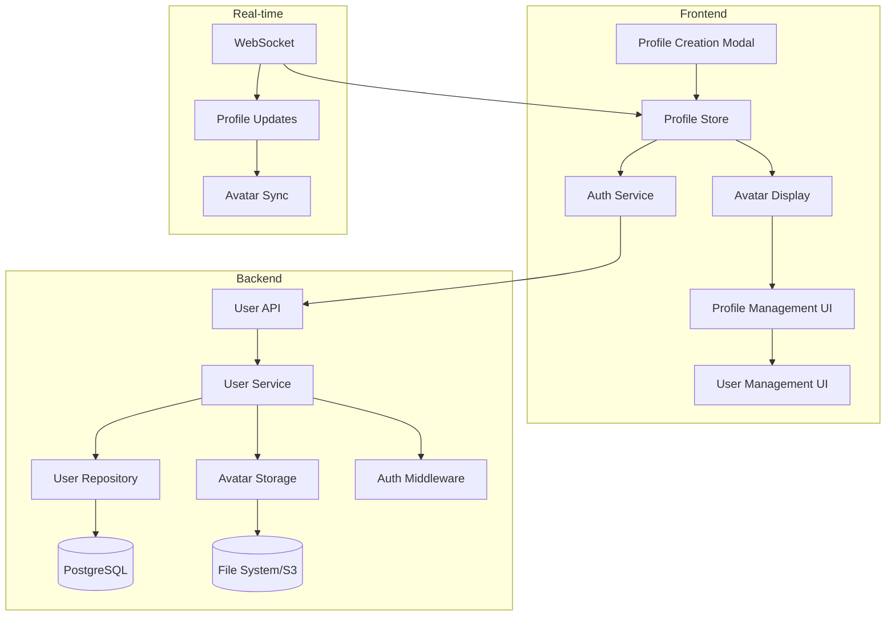

# User Profile & Account System Design

## Overview

This design implements a dual-tier user system with guest profiles (localStorage + backend backup) and full accounts (backend primary). The system provides seamless onboarding while enabling progressive enhancement to full accounts with additional features and cross-device access.

## Architecture

### System Components



### Data Flow

1. **Guest Profile Creation**: Frontend → localStorage → Backend sync
2. **Full Account Creation**: Frontend → Backend → Email verification
3. **Profile Updates**: Frontend → Backend → WebSocket broadcast
4. **Avatar Display**: Backend → CDN/Storage → Frontend rendering

## Components and Interfaces

### Backend Data Models

#### User Model
```go
type User struct {
    ID          uuid.UUID `gorm:"type:uuid;primary_key;default:gen_random_uuid()"`
    DisplayName string    `gorm:"not null;size:50" validate:"required,min=3,max=50"`
    Email       *string   `gorm:"unique;size:255" validate:"omitempty,email"`
    PasswordHash *string  `gorm:"size:255"`
    AvatarURL   *string   `gorm:"size:500"`
    AboutMe     *string   `gorm:"size:500"`
    AccountType string    `gorm:"not null;default:'guest'" validate:"required,oneof=guest full"`
    Role        string    `gorm:"not null;default:'user'" validate:"required,oneof=user admin superadmin"`
    IsActive    bool      `gorm:"not null;default:true"`
    EmailVerified bool    `gorm:"not null;default:false"`
    CreatedAt   time.Time
    UpdatedAt   time.Time
    LastActiveAt *time.Time
}
```

#### Map Model
```go
type Map struct {
    ID          uuid.UUID `gorm:"type:uuid;primary_key;default:gen_random_uuid()"`
    Name        string    `gorm:"not null;size:100" validate:"required,min=3,max=100"`
    Description *string   `gorm:"size:500"`
    CreatedBy   uuid.UUID `gorm:"type:uuid;not null"`
    Creator     User      `gorm:"foreignKey:CreatedBy"`
    IsActive    bool      `gorm:"not null;default:true"`
    CreatedAt   time.Time
    UpdatedAt   time.Time
}
```

#### Session Model (Enhanced)
```go
type Session struct {
    ID          uuid.UUID `gorm:"type:uuid;primary_key;default:gen_random_uuid()"`
    UserID      uuid.UUID `gorm:"type:uuid;not null" validate:"required"`
    User        User      `gorm:"foreignKey:UserID"`
    MapID       uuid.UUID `gorm:"type:uuid;not null" validate:"required"`
    Map         Map       `gorm:"foreignKey:MapID"`
    Position    LatLng    `gorm:"embedded"`
    IsActive    bool      `gorm:"not null;default:true"`
    CreatedAt   time.Time
    UpdatedAt   time.Time
    ExpiresAt   time.Time
}
```

#### POI Model (Enhanced)
```go
type POI struct {
    ID              uuid.UUID `gorm:"type:uuid;primary_key;default:gen_random_uuid()"`
    Name            string    `gorm:"not null;size:100" validate:"required,min=3,max=100"`
    Description     string    `gorm:"not null;size:500" validate:"required,max=500"`
    Position        LatLng    `gorm:"embedded"`
    MaxParticipants int       `gorm:"not null;default:10" validate:"required,min=2,max=50"`
    MapID           uuid.UUID `gorm:"type:uuid;not null" validate:"required"`
    Map             Map       `gorm:"foreignKey:MapID"`
    CreatedBy       uuid.UUID `gorm:"type:uuid;not null"`
    Creator         User      `gorm:"foreignKey:CreatedBy"`
    IsActive        bool      `gorm:"not null;default:true"`
    CreatedAt       time.Time
    UpdatedAt       time.Time
}
```

### Frontend Interfaces

#### User Profile Interface
```typescript
interface UserProfile {
  id: string;
  displayName: string;
  email?: string;
  avatarURL?: string;
  aboutMe?: string;
  accountType: 'guest' | 'full';
  role: 'user' | 'admin' | 'superadmin';
  isActive: boolean;
  emailVerified: boolean;
  createdAt: Date;
  lastActiveAt?: Date;
}
```

#### Avatar Data Interface (Enhanced)
```typescript
interface AvatarData {
  sessionId: string;
  userId: string;
  displayName: string;
  avatarURL?: string;
  position: {
    lat: number;
    lng: number;
  };
  isCurrentUser: boolean;
  isMoving?: boolean;
  role: 'user' | 'admin' | 'superadmin';
}
```

### API Endpoints

#### User Management
- `POST /api/users/profile` - Create guest profile
- `POST /api/users/account` - Upgrade to full account
- `GET /api/users/profile` - Get current user profile
- `PUT /api/users/profile` - Update profile
- `POST /api/users/avatar` - Upload avatar image
- `POST /api/users/verify-email` - Verify email address
- `POST /api/auth/login` - Login with email/password
- `POST /api/auth/logout` - Logout and invalidate session

#### Map Management
- `GET /api/maps` - List available maps
- `GET /api/maps/:id` - Get map details
- `POST /api/maps` - Create new map (admin/superadmin)
- `PUT /api/maps/:id` - Update map (admin/superadmin)
- `GET /api/maps/:id/users` - Get users active on specific map

#### POI Management (Enhanced)
- `GET /api/maps/:mapId/pois` - Get POIs for specific map
- `POST /api/maps/:mapId/pois` - Create POI (full account required)
- `PUT /api/pois/:id` - Update POI (owner or admin)
- `DELETE /api/pois/:id` - Delete POI (owner or admin)
- `POST /api/pois/:id/join` - Join POI
- `POST /api/pois/:id/leave` - Leave POI

#### User Management (Admin/Superadmin)
- `GET /api/admin/users` - List all users (paginated, optionally filtered by map)
- `GET /api/admin/users/:id` - Get user details
- `PUT /api/admin/users/:id/role` - Update user role
- `PUT /api/admin/users/:id/status` - Enable/disable user
- `POST /api/admin/users/:id/reset-password` - Reset user password

## Data Models

### User Profile Storage Strategy

#### Guest Profiles
- **Primary Storage**: Browser localStorage
- **Backup Storage**: Backend database
- **Sync Strategy**: Immediate sync on creation/update
- **Conflict Resolution**: localStorage takes precedence for guest profiles

#### Full Accounts
- **Primary Storage**: Backend database
- **Cache Storage**: Browser localStorage (for performance)
- **Sync Strategy**: Backend authoritative, localStorage cache
- **Conflict Resolution**: Backend always wins

### Avatar Storage

#### Storage Options
1. **Development**: Local file system
2. **Production**: AWS S3 or similar cloud storage
3. **CDN**: CloudFront or similar for global distribution

#### Image Processing
- **Resize**: 128x128px for map display, 256x256px for profile cards
- **Format**: Convert to WebP with JPEG fallback
- **Validation**: File type, size (max 2MB), malware scanning

## Error Handling

### Profile Creation Errors
- **Duplicate Name**: Suggest alternatives with numbers
- **Invalid Email**: Real-time validation with clear messages
- **Upload Failures**: Retry mechanism with progress indication
- **Network Issues**: Queue operations for retry when online

### Authentication Errors
- **Invalid Credentials**: Generic "invalid email or password" message
- **Account Disabled**: Clear message with contact information
- **Email Not Verified**: Resend verification option
- **Session Expired**: Automatic redirect to login with return URL

### Permission Errors
- **Insufficient Role**: Clear message about required permissions
- **Account Type Limitation**: Prompt to upgrade to full account
- **Rate Limiting**: Clear message about temporary restriction

## Testing Strategy

### Unit Tests
- User model validation and business logic
- Profile creation and update workflows
- Avatar upload and processing
- Authentication and authorization
- Role-based access control

### Integration Tests
- Complete profile creation flow (guest → full account)
- Avatar upload and real-time display
- Cross-device profile synchronization
- User management workflows (admin/superadmin)
- WebSocket profile update broadcasting

### End-to-End Tests
- New user onboarding flow
- Profile management across different account types
- Multi-user avatar display and real-time updates
- Admin user management workflows
- Security and permission enforcement

### Security Tests
- Password hashing and validation
- File upload security (malware, type validation)
- Role-based access control enforcement
- SQL injection and XSS prevention
- Rate limiting and abuse prevention

## Security Considerations

### Authentication
- **Password Requirements**: Minimum 8 characters, mixed case, numbers
- **Session Management**: JWT tokens with refresh mechanism
- **Brute Force Protection**: Rate limiting on login attempts
- **Password Reset**: Secure token-based reset flow

### Authorization
- **Role-Based Access**: Hierarchical permissions (user < admin < superadmin)
- **Resource Ownership**: Users can only modify their own profiles
- **Admin Boundaries**: Admins cannot modify superadmin accounts
- **API Security**: All endpoints require authentication except profile creation

### Data Protection
- **Encryption**: All data encrypted in transit (HTTPS)
- **Password Storage**: bcrypt with salt rounds
- **File Upload**: Virus scanning and type validation
- **Data Retention**: Configurable retention policies
- **GDPR Compliance**: Right to deletion and data export

## Performance Considerations

### Frontend Performance
- **Avatar Caching**: Cache avatar images in browser
- **Lazy Loading**: Load user profiles on demand
- **Optimistic Updates**: Immediate UI updates with server sync
- **Bundle Splitting**: Separate profile management code

### Backend Performance
- **Database Indexing**: Indexes on email, displayName, role
- **Avatar CDN**: Global CDN for fast avatar loading
- **Caching**: Redis cache for frequently accessed profiles
- **Connection Pooling**: Efficient database connection management

### Real-time Performance
- **WebSocket Optimization**: Only broadcast relevant profile changes
- **Avatar Compression**: Optimized image sizes for map display
- **Update Batching**: Batch multiple profile updates
- **Connection Management**: Efficient WebSocket connection handling