# Fixed Group Video Modal - Sequence Diagram

## Scenario: 2 Users, 1 POI - After Implementing Fixes

This diagram shows how the group video modal triggering will work after implementing the centralized group call logic and race condition fixes.

```mermaid
sequenceDiagram
    participant U1 as User 1 (First)
    participant App1 as App.tsx (User 1)
    participant POIStore as POI Store
    participant VideoStore as Video Call Store
    participant WS1 as WebSocket Client 1
    participant BE as Backend WebSocket Handler
    participant WS2 as WebSocket Client 2
    participant App2 as App.tsx (User 2)
    participant U2 as User 2 (Second)
    participant WebRTC1 as WebRTC Service 1
    participant WebRTC2 as WebRTC Service 2

    Note over U1, U2: Initial Setup - Both users connected to map

    %% User 1 joins POI first
    U1->>App1: Click POI to join
    App1->>POIStore: joinPOIOptimisticWithAutoLeave(poiId, user1Id)
    Note over POIStore: Set currentUserPOI = poiId IMMEDIATELY
    POIStore-->>App1: success = true
    
    App1->>VideoStore: checkAndStartGroupCall(poiId, 1, user1Id)
    Note over VideoStore: participantCount = 1, no group call needed
    VideoStore-->>App1: No action (single participant)
    
    App1->>BE: API call - joinPOI(poiId, user1Id)
    BE-->>App1: Success response
    App1->>POIStore: confirmJoinPOI(poiId, user1Id)
    
    BE->>WS1: poi_join_ack
    BE->>WS2: poi_joined broadcast (currentCount: 1)
    Note over WS2: User 2 sees User 1 joined, but no group call trigger

    %% User 2 joins the same POI
    U2->>App2: Click same POI to join
    App2->>POIStore: joinPOIOptimisticWithAutoLeave(poiId, user2Id)
    Note over POIStore: Set currentUserPOI = poiId IMMEDIATELY
    POIStore-->>App2: success = true
    
    App2->>VideoStore: checkAndStartGroupCall(poiId, 2, user2Id)
    Note over VideoStore: Check initialization lock
    VideoStore->>VideoStore: _initializingGroupCall = true
    VideoStore->>VideoStore: joinPOICall(poiId)
    Note over VideoStore: isGroupCallActive = true, currentPOI = poiId
    Note over App2: 🎥 GROUP CALL MODAL SHOWS for User 2
    
    VideoStore->>VideoStore: initializeGroupWebRTC()
    VideoStore->>WebRTC2: new GroupWebRTCService()
    WebRTC2->>WebRTC2: getUserMedia() - get local stream
    VideoStore->>VideoStore: _initializingGroupCall = false
    
    App2->>BE: API call - joinPOI(poiId, user2Id)
    BE-->>App2: Success response
    App2->>POIStore: confirmJoinPOI(poiId, user2Id)
    
    BE->>WS2: poi_join_ack
    BE->>WS1: poi_joined broadcast (currentCount: 2, participants: [user1, user2])

    %% User 1 receives WebSocket event - CENTRALIZED LOGIC
    WS1->>VideoStore: checkAndStartGroupCall(poiId, 2, user1Id)
    Note over VideoStore: Check if already initializing
    alt Group call not active for this POI
        VideoStore->>VideoStore: _initializingGroupCall = true
        VideoStore->>VideoStore: joinPOICall(poiId)
        Note over VideoStore: isGroupCallActive = true, currentPOI = poiId
        Note over App1: 🎥 GROUP CALL MODAL SHOWS for User 1
        
        VideoStore->>VideoStore: initializeGroupWebRTC()
        VideoStore->>WebRTC1: new GroupWebRTCService()
        WebRTC1->>WebRTC1: getUserMedia() - get local stream
        VideoStore->>VideoStore: _initializingGroupCall = false
        
        %% Add existing participants
        VideoStore->>VideoStore: addGroupCallParticipant(user2Id, participant2Data)
        VideoStore->>WebRTC1: addPeer(user2Id)
    else Group call already active
        Note over VideoStore: Skip - already active for this POI
    end

    %% WebRTC Connection Establishment (Same as before)
    WebRTC1->>WebRTC1: createOffer()
    WebRTC1->>WS1: onIceCandidate callback
    WS1->>BE: poi_call_offer message
    BE->>WS2: poi_call_offer forwarded

    WS2->>WebRTC2: addPeer(user1Id)
    WebRTC2->>WebRTC2: setRemoteDescription(offer)
    WebRTC2->>WebRTC2: createAnswer()
    WebRTC2->>WS2: onIceCandidate callback
    WS2->>BE: poi_call_answer message
    BE->>WS1: poi_call_answer forwarded

    WS1->>WebRTC1: setRemoteDescription(answer)
    
    %% ICE candidate exchange
    WebRTC1->>WS1: ICE candidate generated
    WS1->>BE: poi_call_ice_candidate
    BE->>WS2: poi_call_ice_candidate forwarded
    WS2->>WebRTC2: addIceCandidate()
    
    WebRTC2->>WS2: ICE candidate generated
    WS2->>BE: poi_call_ice_candidate
    BE->>WS1: poi_call_ice_candidate forwarded
    WS1->>WebRTC1: addIceCandidate()

    %% Connection established
    WebRTC1->>WebRTC1: ICE connection established
    WebRTC2->>WebRTC2: ICE connection established
    WebRTC1->>VideoStore: onRemoteStreamForUser callback
    WebRTC2->>VideoStore: onRemoteStreamForUser callback
    
    Note over U1, U2: 🎥 BOTH USERS SEE GROUP CALL MODAL WITH VIDEO

    %% User leaves POI - Centralized cleanup
    U1->>App1: Leave POI
    App1->>POIStore: leavePOI(poiId, user1Id)
    POIStore->>POIStore: currentUserPOI = null
    
    App1->>VideoStore: checkAndEndGroupCall(poiId, user1Id)
    VideoStore->>VideoStore: leavePOICall()
    Note over App1: 🚫 GROUP CALL MODAL HIDDEN for User 1
    VideoStore->>WebRTC1: cleanup()
    
    App1->>BE: API call - leavePOI(poiId, user1Id)
    BE->>WS1: poi_leave_ack
    BE->>WS2: poi_left broadcast (currentCount: 1)
    
    WS2->>VideoStore: checkAndEndGroupCall(poiId, user1Id)
    Note over VideoStore: currentCount = 1, end group call
    VideoStore->>VideoStore: leavePOICall()
    Note over App2: 🚫 GROUP CALL MODAL HIDDEN for User 2
    VideoStore->>WebRTC2: cleanup()
```



## Key Improvements in Fixed Version

### 1. **Centralized Group Call Logic**
```typescript
// Single method in VideoCallStore
checkAndStartGroupCall(poiId: string, participantCount: number, currentUserId: string) {
  // All group call decisions go through this method
  // Prevents race conditions and duplicate logic
}
```

### 2. **Immediate State Updates**
```typescript
// In POIStore.joinPOIOptimisticWithAutoLeave()
set({ 
  currentUserPOI: poiId,  // Set IMMEDIATELY, not after API response
  // ... other state
});
```

### 3. **Initialization Lock**
```typescript
// In VideoCallStore
private _initializingGroupCall: boolean = false;

checkAndStartGroupCall() {
  if (this._initializingGroupCall) {
    console.log('Group call initialization already in progress');
    return;
  }
  this._initializingGroupCall = true;
  // ... safe initialization
  this._initializingGroupCall = false;
}
```

### 4. **Direct Imports (No Async Issues)**
```typescript
// In websocket-client.ts - no more dynamic imports
import { videoCallStore } from '../stores/videoCallStore';

handlePOIJoined(data) {
  videoCallStore.getState().checkAndStartGroupCall(poiId, currentCount, userId);
}
```

### 5. **Consistent Modal Display Logic**
```typescript
// In App.tsx - modal shows when:
{videoCallState.isGroupCallActive && videoCallState.currentPOI && (
  <GroupCallModal isOpen={true} ... />
)}

// These states are now managed by single centralized method
```

## Benefits of Fixed Approach

### ✅ **Race Condition Eliminated**
- Only one code path can trigger group calls
- Initialization lock prevents duplicate calls
- State changes are atomic

### ✅ **Reliable Modal Triggering**
- Modal shows immediately when `isGroupCallActive` becomes true
- State is set synchronously, no async delays
- Both users get modal reliably

### ✅ **Consistent State Management**
- `currentUserPOI` set immediately during optimistic updates
- No dependency on API response timing
- WebSocket events use same logic as direct joins

### ✅ **Better Error Handling**
- Single place to handle group call failures
- Retry logic centralized
- Clear error states

### ✅ **Easier Testing**
- Single method to test for group call logic
- Predictable state transitions
- No race conditions to test around

## Test Scenarios That Now Work

1. **Simultaneous Joins**: Both users join within 100ms → Both see modal
2. **Slow API**: API takes 5 seconds → Modal shows immediately on optimistic update
3. **WebSocket Delays**: WebSocket event delayed → Modal still shows via direct path
4. **Network Issues**: API fails → Optimistic update rolled back, modal hidden
5. **Page Refresh**: User refreshes during call → State recovered, modal shows

The key insight is that **all group call decisions now flow through a single, centralized method** that handles all the edge cases and race conditions in one place, making the modal triggering reliable and predictable.