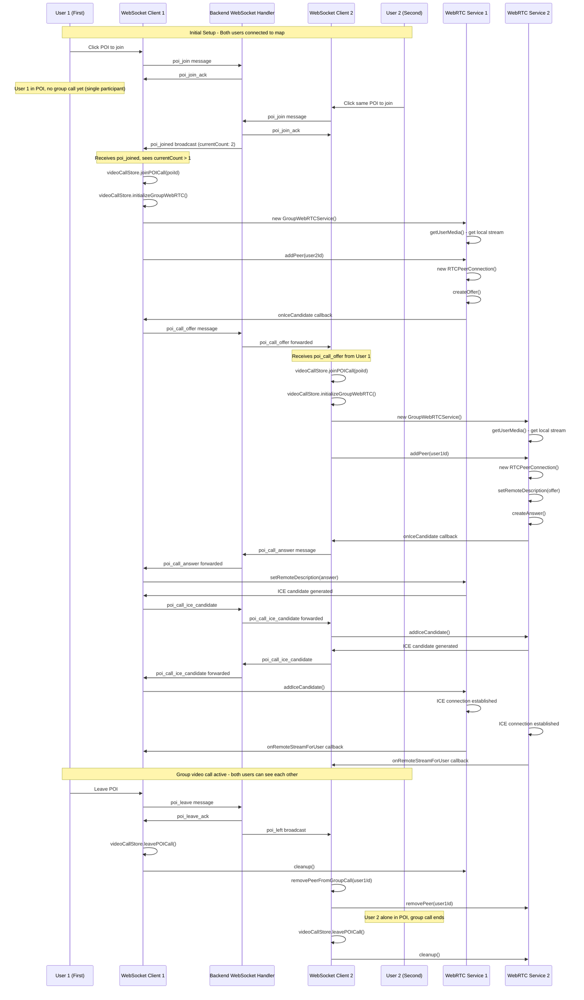

# POI Group Video Call - Sequence Diagram

## Scenario: 2 Users, 1 POI - WebRTC Flow Analysis

Based on the codebase analysis, here's the detailed sequence diagram for the POI group video call functionality:



## Key Issues Identified

### 1. **Race Condition in Group Call Initialization**
- **Problem**: When User 2 joins POI, both users might try to initialize group calls simultaneously
- **Location**: `frontend/src/services/websocket-client.ts:handlePOIJoined()`
- **Impact**: Duplicate WebRTC service creation, connection failures

### 2. **Peer Connection Timing Issues**
- **Problem**: ICE candidates might arrive before peer connections are established
- **Location**: `frontend/src/services/websocket-client.ts:handlePOICallICECandidate()`
- **Current Behavior**: ICE candidates are ignored if no peer connection exists
- **Impact**: Connection establishment failures

### 3. **Inconsistent Group Call State Management**
- **Problem**: Group call state not properly synchronized between participants
- **Location**: `frontend/src/stores/videoCallStore.ts`
- **Impact**: UI inconsistencies, call state mismatches

### 4. **Missing Error Handling for WebRTC Failures**
- **Problem**: No retry mechanism for failed peer connections
- **Location**: `frontend/src/services/webrtc-service.ts:GroupWebRTCService`
- **Impact**: Permanent connection failures

### 5. **Display Name Resolution Issues**
- **Problem**: Inconsistent display name resolution across different code paths
- **Location**: Multiple files - websocket handlers, stores
- **Impact**: Users shown as "Unknown User" or UUID fragments

## Recommended Fixes

### 1. **Implement Proper Initialization Sequencing**
```typescript
// Add initialization lock to prevent race conditions
private _initializingGroupWebRTC: boolean = false;

async initializeGroupWebRTC() {
  if (this._initializingGroupWebRTC) {
    // Wait for ongoing initialization
    while (this._initializingGroupWebRTC) {
      await new Promise(resolve => setTimeout(resolve, 50));
    }
    return;
  }
  this._initializingGroupWebRTC = true;
  // ... initialization logic
  this._initializingGroupWebRTC = false;
}
```

### 2. **Add ICE Candidate Queuing**
```typescript
// Queue ICE candidates until peer connection is ready
private pendingIceCandidates: Map<string, RTCIceCandidateInit[]> = new Map();

handlePOICallICECandidate(data: any) {
  const peerConnection = this.peerConnections.get(fromUserId);
  if (!peerConnection) {
    // Queue candidate for later
    if (!this.pendingIceCandidates.has(fromUserId)) {
      this.pendingIceCandidates.set(fromUserId, []);
    }
    this.pendingIceCandidates.get(fromUserId)!.push(candidate);
    return;
  }
  // Process candidate immediately
  peerConnection.addIceCandidate(candidate);
}
```

### 3. **Add Connection State Synchronization**
```typescript
// Broadcast group call state changes
broadcastGroupCallState(poiId: string, state: GroupCallState) {
  this.manager.BroadcastToPOI(poiId, {
    type: 'group_call_state_update',
    data: { poiId, state }
  });
}
```

### 4. **Implement Retry Logic**
```typescript
// Add retry mechanism for failed connections
async addPeerWithRetry(userId: string, maxRetries: number = 3) {
  for (let attempt = 1; attempt <= maxRetries; attempt++) {
    try {
      await this.addPeer(userId);
      return;
    } catch (error) {
      if (attempt === maxRetries) throw error;
      await new Promise(resolve => setTimeout(resolve, 1000 * attempt));
    }
  }
}
```

## Testing Strategy

1. **Unit Tests**: Test individual WebRTC service methods
2. **Integration Tests**: Test complete POI join → group call flow
3. **Race Condition Tests**: Simulate simultaneous POI joins
4. **Network Failure Tests**: Test connection recovery scenarios
5. **Load Tests**: Test with multiple participants (3+ users)

This analysis reveals that while the basic WebRTC infrastructure is in place, there are several timing and state management issues that could cause the group video calls to fail or behave inconsistently, especially when users join POIs in quick succession.